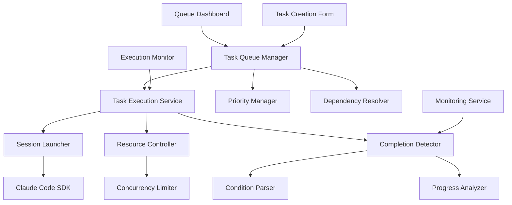

# Design Document

## Overview

Automated Task Queue Management extends the existing CC-Tasks system from a monitoring and viewing platform to a comprehensive orchestration system. This feature transforms the current static task data (currently mock) into a dynamic, automated execution engine that can create, prioritize, launch, monitor, and complete development tasks through automated Claude Code session management. The design builds on the existing monitoring infrastructure to provide the core value proposition of intelligent task orchestration.

## Steering Document Alignment

### Technical Standards (tech.md)

The design follows established architectural patterns:
- **React with TypeScript**: Maintains type safety for complex task states and automation workflows
- **Next.js App Router**: Leverages existing routing for task management interfaces
- **Service Layer Architecture**: Extends current service patterns for automated execution management
- **Component Modularity**: Builds focused components for task creation, queue management, and automation control

### Project Structure (structure.md)

Implementation will follow the established organization:
- **Services**: `lib/services/taskQueueService.ts`, `lib/services/taskExecutionService.ts`, `lib/services/completionDetectionService.ts`
- **Types**: `lib/types/queue.ts` for queue-specific data models extending existing task types
- **Components**: `components/queue/` directory for queue management UI components
- **Hooks**: `hooks/useTaskQueue.ts` (extend existing), `hooks/useTaskExecution.ts` for automation state

## Code Reuse Analysis

### Existing Components to Leverage

- **TaskService**: Will be extended to support automated execution and completion detection
- **MonitoringService**: Will integrate to provide real-time feedback during automated execution
- **SessionController**: Will be leveraged for programmatic Claude Code session launching and control
- **TaskPipeline**: Will be enhanced to show automated execution progress and queue status
- **useTaskQueue**: Will be extended with automation capabilities and real-time execution tracking

### Integration Points

- **Claude Code SDK Integration**: Will build on patterns described in `how_to_manage_claude_code.md` for programmatic session launching
- **Session Monitoring**: Will leverage existing real-time monitoring for execution tracking
- **File System Detection**: Will use existing session detection for completion condition verification
- **Task Storage**: Will extend existing task persistence with queue state and execution history

## Architecture

The automated queue management system uses an event-driven architecture with separate services for queue management, execution coordination, and completion detection. The design ensures robust automation while maintaining manual override capabilities and comprehensive monitoring.

### Modular Design Principles
- **Single File Responsibility**: Each automation component handles one aspect (queue management, execution, completion detection, resource control)
- **Component Isolation**: Task creation, execution coordination, and completion detection are separate services
- **Service Layer Separation**: Queue logic separated from execution management and UI presentation
- **Utility Modularity**: Task validation, session launching, and completion detection in focused modules



## Components and Interfaces

### TaskQueueService
- **Purpose:** Central service for queue management, prioritization, and task lifecycle coordination
- **Interfaces:** `addTask()`, `updatePriority()`, `resolveNextTask()`, `updateTaskStatus()`
- **Dependencies:** Task persistence, dependency resolution, priority management
- **Reuses:** Existing TaskService patterns, extends with queue management and automation logic

### TaskExecutionService
- **Purpose:** Orchestrates automated task execution including session launching and resource management
- **Interfaces:** `executeTask()`, `pauseExecution()`, `resumeExecution()`, `abortExecution()`
- **Dependencies:** SessionController, Resource limits, MonitoringService integration
- **Reuses:** SessionController for session management, MonitoringService for execution tracking

### CompletionDetectionService
- **Purpose:** Monitors task progress and automatically detects completion condition fulfillment
- **Interfaces:** `registerCompletionCondition()`, `checkCompletion()`, `parseCondition()`
- **Dependencies:** Session monitoring, file system access, condition parsing utilities
- **Reuses:** MonitoringService patterns, session state detection from monitoring infrastructure

### PriorityManager
- **Purpose:** Handles task prioritization, ordering, and dependency resolution
- **Interfaces:** `setPriority()`, `resolveDependencies()`, `getNextTask()`, `detectCircularDependencies()`
- **Dependencies:** Task relationships, dependency validation
- **Reuses:** Existing task data structures, extends with priority and dependency metadata

### ResourceController
- **Purpose:** Manages concurrent session limits and system resource allocation
- **Interfaces:** `checkResourceAvailability()`, `reserveResources()`, `releaseResources()`
- **Dependencies:** System monitoring, session tracking
- **Reuses:** Existing session counting from monitoring service, extends with resource management

### useTaskExecution Hook
- **Purpose:** React hook for managing automated execution state with real-time updates
- **Interfaces:** `executionState`, `queueStatus`, `resourceUsage`, `controls`
- **Dependencies:** TaskExecutionService, real-time update mechanisms
- **Reuses:** useTaskQueue patterns, extends with automation state management

## Data Models

### QueuedTask
```typescript
interface QueuedTask extends Task {
  priority: 'high' | 'medium' | 'low';
  position: number;
  dependencies: string[]; // Task IDs that must complete first
  estimatedDuration?: number; // Minutes
  maxRetries: number;
  retryCount: number;
  resourceRequirements: {
    maxConcurrentSessions: number;
    estimatedTokens: number;
  };
  automation: {
    autoStart: boolean;
    autoRetry: boolean;
    completionTimeout: number; // Minutes
  };
}
```

### ExecutionState
```typescript
interface ExecutionState {
  taskId: string;
  status: 'launching' | 'executing' | 'monitoring' | 'completing' | 'failed';
  sessionId?: string;
  startedAt: Date;
  lastActivity: Date;
  completionProgress: {
    conditionsMet: string[];
    conditionsPending: string[];
    estimatedCompletion?: Date;
  };
  resourceUsage: {
    tokensUsed: number;
    executionTime: number; // Minutes
    memoryUsage: number;
  };
  retryHistory: Array<{
    attempt: number;
    failureReason: string;
    timestamp: Date;
  }>;
}
```

### CompletionCondition
```typescript
interface CompletionCondition {
  type: 'file_exists' | 'test_passes' | 'contains_text' | 'manual_review' | 'token_limit';
  parameters: Record<string, any>;
  description: string;
  checkInterval: number; // Seconds
  timeout: number; // Minutes
  validator: (context: ExecutionContext) => Promise<boolean>;
}
```

### QueueConfiguration
```typescript
interface QueueConfiguration {
  maxConcurrentTasks: number;
  defaultPriority: 'high' | 'medium' | 'low';
  autoStartEnabled: boolean;
  completionCheckInterval: number; // Seconds
  resourceLimits: {
    maxTokensPerTask: number;
    maxExecutionTime: number; // Minutes
    maxRetries: number;
  };
  notifications: {
    onTaskComplete: boolean;
    onTaskFailed: boolean;
    onQueueEmpty: boolean;
  };
}
```

## Error Handling

### Error Scenarios

1. **Session Launch Failure:** Claude Code session fails to start or becomes unresponsive
   - **Handling:** Exponential backoff retry with maximum attempts, fallback to manual mode
   - **User Impact:** Task marked as "Launch Failed" with retry option and manual intervention guidance

2. **Completion Condition Parse Error:** User-defined completion conditions cannot be interpreted
   - **Handling:** Validate conditions during task creation, provide suggestion engine for common patterns
   - **User Impact:** Clear error message with completion condition examples and correction suggestions

3. **Resource Exhaustion:** System runs out of available Claude Code sessions or memory
   - **Handling:** Queue tasks until resources available, implement resource reservation system
   - **User Impact:** Task shows "Waiting for Resources" status with estimated availability time

4. **Circular Dependency Detection:** Task dependencies create impossible execution order
   - **Handling:** Detect cycles during dependency setup, suggest dependency resolution
   - **User Impact:** Clear dependency conflict visualization with suggested fixes

5. **Task Timeout Exceeded:** Task execution exceeds configured maximum time limits
   - **Handling:** Gracefully terminate session, preserve partial work, mark for manual review
   - **User Impact:** Task marked as "Timed Out" with partial results and continuation options

## Testing Strategy

### Unit Testing
- Task queue operations (add, prioritize, resolve dependencies)
- Completion condition parsing and validation logic
- Resource allocation and concurrency control mechanisms
- Priority resolution and dependency graph analysis

### Integration Testing
- End-to-end automated task execution flow from creation to completion
- Integration between queue management and session monitoring systems
- Resource management under concurrent task execution scenarios
- Completion detection across different condition types

### End-to-End Testing
- Complete automated workflow: create task → auto-execute → detect completion → mark complete
- Complex scenarios: multiple dependent tasks with different priorities and resource requirements
- Failure recovery: session crashes, condition timeouts, resource exhaustion recovery
- Manual intervention scenarios: pause automation, modify tasks mid-execution, override completion detection