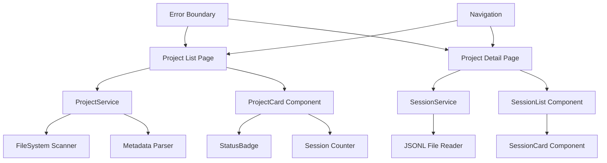

# Design Document

## Overview

The Claude Code Project Browser is a read-only web interface built on the existing Next.js application architecture. It extends the current task management system with Claude Code project discovery capabilities, leveraging established patterns for data services, UI components, and type definitions. The feature integrates seamlessly with the existing component library and follows the established modular design principles.

## Steering Document Alignment

### Technical Standards (tech.md)
The design follows Next.js 15.5.3 patterns with React 19.1.0, TypeScript 5, and Tailwind CSS 4. It maintains consistency with the existing codebase architecture, using established service patterns for data access and component patterns for UI rendering. File system operations utilize Node.js native APIs for reliability and security.

### Project Structure (structure.md)
Implementation follows the established project organization:
- **lib/services/**: Project scanning and metadata services
- **lib/types/**: Type definitions for projects and sessions
- **components/**: Reusable UI components following existing patterns
- **app/**: Next.js App Router pages for navigation

## Code Reuse Analysis

### Existing Components to Leverage
- **StatusBadge**: Adapt for project activity status (active/idle) with custom status tokens
- **TaskQueueForm**: Reference form patterns for future project actions
- **TaskPipeline**: Reference layout patterns for project listing displays
- **Layout patterns**: Apply consistent spacing, typography, and responsive design

### Integration Points
- **taskService pattern**: Create `projectService` following same interface conventions
- **Type definitions**: Extend existing type patterns in lib/types/
- **Component architecture**: Follow established component composition patterns
- **Routing**: Integrate with Next.js App Router for project navigation

## Architecture

The feature follows a layered architecture separating data access, business logic, and presentation concerns:

### Modular Design Principles
- **Single File Responsibility**: Each service handles one domain (project scanning, session parsing, metadata extraction)
- **Component Isolation**: Small, focused components with clear props interfaces
- **Service Layer Separation**: File system access isolated from business logic and UI rendering
- **Utility Modularity**: Path utilities, validation helpers, and error handling in focused modules



## Components and Interfaces

### ProjectService
- **Purpose:** File system scanning and project metadata extraction
- **Interfaces:**
  - `listProjects(): Promise<Project[]>`
  - `getProject(id: string): Promise<Project | null>`
  - `getProjectSessions(projectId: string): Promise<Session[]>`
- **Dependencies:** Node.js fs/promises, path utilities
- **Reuses:** Service pattern from taskService.ts

### SessionService
- **Purpose:** Session file metadata extraction (no content parsing)
- **Interfaces:**
  - `getSessionMetadata(filePath: string): Promise<SessionMetadata>`
  - `listSessionFiles(projectPath: string): Promise<string[]>`
- **Dependencies:** Node.js fs/promises, file stat utilities
- **Reuses:** Error handling patterns from existing services

### ProjectCard Component
- **Purpose:** Display individual project summary in list view
- **Interfaces:**
  - Props: `{ project: Project; onClick: () => void }`
- **Dependencies:** StatusBadge, session counter utility
- **Reuses:** StatusBadge styling patterns, card layout from existing components

### ProjectList Component
- **Purpose:** Render paginated list of all projects
- **Interfaces:**
  - Props: `{ projects: Project[]; onProjectSelect: (id: string) => void }`
- **Dependencies:** ProjectCard, loading states, error boundaries
- **Reuses:** List rendering patterns from TaskPipeline

### SessionCard Component
- **Purpose:** Display session file metadata in project detail view
- **Interfaces:**
  - Props: `{ session: SessionMetadata }`
- **Dependencies:** File size formatter, date utilities
- **Reuses:** Card styling from existing components

### Navigation Component
- **Purpose:** Breadcrumb navigation between views
- **Interfaces:**
  - Props: `{ currentProject?: Project; onNavigateHome: () => void }`
- **Dependencies:** Next.js router utilities
- **Reuses:** Navigation patterns from existing layout

## Data Models

### Project
```typescript
interface Project {
  id: string;              // Directory name
  name: string;            // From meta.json or directory name fallback
  path: string;            // Absolute path to project directory
  sessionCount: number;    // Count of .jsonl files in conversations/
  lastModified: Date;      // Most recent file modification in project
  status: 'active' | 'idle'; // Based on recent activity (< 30 days)
}
```

### SessionMetadata
```typescript
interface SessionMetadata {
  id: string;              // Filename without extension
  fileName: string;        // Full filename with extension
  filePath: string;        // Relative path within project
  fileSize: number;        // File size in bytes
  lastModified: Date;      // File modification timestamp
  isValid: boolean;        // Whether file is readable/accessible
}
```

### ProjectMeta
```typescript
interface ProjectMeta {
  name?: string;           // Project display name
  description?: string;    // Optional project description
  createdAt?: string;      // Project creation timestamp
  [key: string]: any;      // Allow additional metadata
}
```

## Error Handling

### Error Scenarios
1. **Claude Projects Directory Missing:**
   - **Handling:** Display empty state with setup instructions
   - **User Impact:** Clear guidance on Claude Code setup requirements

2. **Permission Denied on Project Directory:**
   - **Handling:** Log error, show project with limited metadata
   - **User Impact:** Warning badge indicating access issues

3. **Corrupted meta.json Files:**
   - **Handling:** Fallback to directory name, log warning
   - **User Impact:** Project still displayed with basic information

4. **Inaccessible Session Files:**
   - **Handling:** Skip corrupted files, show available sessions
   - **User Impact:** Partial session list with error indicator

5. **Network/Loading Failures:**
   - **Handling:** Retry mechanism with exponential backoff
   - **User Impact:** Loading states with retry options

## Testing Strategy

### Unit Testing
- **File System Services:** Mock fs operations for project/session scanning
- **Data Parsing:** Test meta.json parsing with various valid/invalid inputs
- **Utility Functions:** Path manipulation, date formatting, file size conversion
- **Component Rendering:** Props handling, error states, loading states

### Integration Testing
- **Service Integration:** End-to-end project discovery with real file system
- **Component Integration:** Project list → detail navigation flows
- **Error Boundary Testing:** Graceful failure handling across component tree

### End-to-End Testing
- **Project Discovery Flow:** Load application → see projects → navigate to details
- **Empty States:** No projects directory, empty projects, no sessions
- **Error Recovery:** Permission failures, corrupted files, network issues
- **Performance:** Large project collections (50+ projects, 100+ sessions)