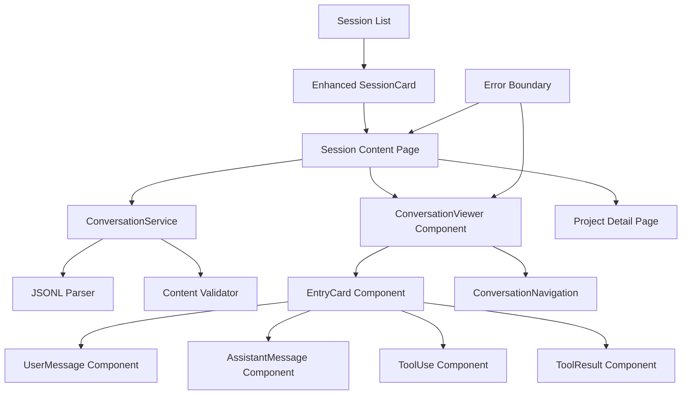

# Design Document

## Overview

The Claude Code Session Content Viewer extends the existing Project Browser architecture by adding JSONL parsing and conversation display capabilities. This feature transforms static session metadata into readable conversation history, enabling users to review their Claude Code interactions through a clean, structured interface. The design builds directly on the established project discovery infrastructure while introducing new components for conversation parsing, display, and navigation.

## Steering Document Alignment

### Technical Standards (tech.md)
The design maintains consistency with the Next.js 15.5.3 + React 19.1.0 + TypeScript 5 stack, following established patterns for service layers, component architecture, and type definitions. JSONL parsing utilizes Node.js native APIs for security and performance, while the UI components extend the existing Tailwind CSS 4 design system.

### Project Structure (structure.md)
Implementation follows the established project organization:
- **lib/types/**: Extended with conversation entry type definitions
- **lib/services/**: New conversationService for JSONL parsing
- **components/conversations/**: New component directory for conversation display
- **app/projects/[id]/sessions/[sessionId]/**: New route structure for session content

## Code Reuse Analysis

### Existing Components to Leverage
- **StatusBadge**: Adapt for conversation entry types (user/assistant/tool_use/tool_result)
- **ProjectNavigation**: Extend for session-level breadcrumb navigation
- **SessionCard**: Add "View Content" action button
- **Error handling patterns**: Apply existing error boundary and validation approaches

### Integration Points
- **projectService/sessionService**: Extend with conversation content retrieval
- **Project type definitions**: Add conversation-related metadata
- **Navigation patterns**: Integrate session content routing with existing project navigation
- **Component styling**: Maintain consistency with established card layouts and typography

## Architecture

The feature introduces a conversation-focused layer while maintaining separation of concerns between file system access, content parsing, and UI rendering:

### Modular Design Principles
- **Single File Responsibility**: JSONL parsing, conversation rendering, and entry type display in focused modules
- **Component Isolation**: Small, specialized components for different conversation entry types
- **Service Layer Separation**: Content parsing isolated from display logic and file system access
- **Utility Modularity**: Date formatting, content sanitization, and navigation helpers in dedicated utilities



## Components and Interfaces

### ConversationService
- **Purpose:** JSONL file parsing and conversation entry extraction
- **Interfaces:**
  - `parseSessionContent(projectId: string, sessionId: string): Promise<ConversationEntry[]>`
  - `validateEntry(entry: unknown): ConversationEntry | null`
  - `getSessionStats(entries: ConversationEntry[]): SessionStats`
- **Dependencies:** Node.js fs/promises, content validation utilities
- **Reuses:** Path validation patterns from projectService and sessionService

### ConversationViewer Component
- **Purpose:** Main container for conversation display with navigation and scrolling
- **Interfaces:**
  - Props: `{ projectId: string; sessionId: string; entries: ConversationEntry[] }`
- **Dependencies:** EntryCard, ConversationNavigation, scroll management hooks
- **Reuses:** Loading states and error handling patterns from ProjectList

### EntryCard Component
- **Purpose:** Polymorphic component for rendering different conversation entry types
- **Interfaces:**
  - Props: `{ entry: ConversationEntry; index: number }`
- **Dependencies:** UserMessage, AssistantMessage, ToolUse, ToolResult components
- **Reuses:** Card styling patterns and layout from existing components

### UserMessage Component
- **Purpose:** Display user input messages with proper styling and metadata
- **Interfaces:**
  - Props: `{ content: string; timestamp: string; metadata?: EntryMetadata }`
- **Dependencies:** Content sanitization utilities, timestamp formatting
- **Reuses:** Typography and spacing patterns from existing message displays

### AssistantMessage Component
- **Purpose:** Display Claude assistant responses with formatting preservation
- **Interfaces:**
  - Props: `{ content: string; timestamp: string; metadata?: EntryMetadata }`
- **Dependencies:** Markdown/code block rendering, content sanitization
- **Reuses:** Content formatting patterns and responsive text layout

### ToolUse Component
- **Purpose:** Display tool invocation details including tool name and parameters
- **Interfaces:**
  - Props: `{ toolName: string; parameters: object; timestamp: string; id: string }`
- **Dependencies:** JSON formatting utilities, parameter display helpers
- **Reuses:** Code display patterns and structured data formatting

### ToolResult Component
- **Purpose:** Display tool execution results and associate with corresponding tool use
- **Interfaces:**
  - Props: `{ result: string; toolUseId: string; timestamp: string; isError?: boolean }`
- **Dependencies:** Result formatting, error state styling
- **Reuses:** Error display patterns and code output formatting

### ConversationNavigation Component
- **Purpose:** Navigation controls for long conversations (scroll to top/bottom, progress indicators)
- **Interfaces:**
  - Props: `{ totalEntries: number; currentPosition: number; onNavigate: (position: number) => void }`
- **Dependencies:** Scroll management utilities, position tracking
- **Reuses:** Navigation button styles and accessibility patterns

## Data Models

### ConversationEntry
```typescript
interface ConversationEntry {
  id?: string;                    // Optional entry identifier
  type: 'user' | 'assistant' | 'tool_use' | 'tool_result';
  content: string;                // Main entry content
  timestamp: string;              // ISO timestamp or relative time
  metadata?: EntryMetadata;       // Additional entry information
  toolName?: string;              // For tool_use entries
  toolUseId?: string;             // For tool_result entries linking to tool_use
  parameters?: Record<string, any>; // For tool_use entries
  isError?: boolean;              // For tool_result entries indicating errors
}
```

### EntryMetadata
```typescript
interface EntryMetadata {
  index?: number;                 // Position in conversation
  duration?: number;              // Time taken for processing (ms)
  tokenCount?: number;            // Token usage for entry
  model?: string;                 // Model used for assistant responses
  [key: string]: any;             // Flexible additional metadata
}
```

### SessionStats
```typescript
interface SessionStats {
  totalEntries: number;           // Total conversation entries
  userMessages: number;           // Count of user inputs
  assistantMessages: number;      // Count of assistant responses
  toolInvocations: number;        // Count of tool uses
  totalTokens?: number;           // Aggregate token usage
  duration?: number;              // Session duration in minutes
  firstTimestamp: string;         // Session start time
  lastTimestamp: string;          // Session end time
}
```

## Error Handling

### Error Scenarios
1. **Corrupted JSONL Files:**
   - **Handling:** Parse valid entries, skip malformed lines with warning logs
   - **User Impact:** Partial conversation display with notification of skipped entries

2. **Missing Session Files:**
   - **Handling:** Redirect to project detail with error message
   - **User Impact:** Clear explanation and navigation back to session list

3. **Large File Parsing:**
   - **Handling:** Stream parsing with progress indicators, memory management
   - **User Impact:** Loading progress bar and responsive interface during parsing

4. **Content Rendering Failures:**
   - **Handling:** Safe fallback rendering with error boundaries
   - **User Impact:** Entry marked as "Content unavailable" with raw data option

5. **Navigation State Loss:**
   - **Handling:** URL state persistence and scroll position restoration
   - **User Impact:** Maintained position when returning from other views

## Testing Strategy

### Unit Testing
- **JSONL Parser:** Test with valid/invalid JSON lines, edge cases, malformed data
- **Content Sanitization:** XSS prevention, special character handling, code block preservation
- **Entry Components:** Props handling, content rendering, timestamp formatting
- **Navigation State:** Scroll position tracking, URL state management

### Integration Testing
- **Session to Content Flow:** Navigation from session list → content view → back navigation
- **Large File Handling:** Performance testing with 50MB JSONL files and 1000+ entries
- **Error Recovery:** Graceful handling of file system errors and parsing failures

### End-to-End Testing
- **Complete User Journey:** Project discovery → session selection → content viewing → navigation
- **Cross-Entry Navigation:** Scrolling through long conversations, jumping to positions
- **Responsive Behavior:** Different screen sizes, keyboard navigation, accessibility compliance
- **Performance Validation:** Load times under 5 seconds, smooth scrolling, memory efficiency