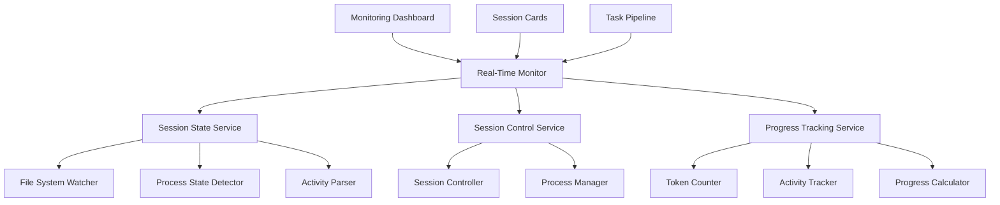

# Design Document

## Overview

Real-Time Session Monitoring extends the current CC-Manager system with live visibility into active Claude Code sessions. The feature builds on the existing session discovery and viewing capabilities to provide continuous monitoring of session state, progress tracking, and interactive session controls. This creates a comprehensive monitoring dashboard that transforms the static task queue into a dynamic orchestration interface.

## Steering Document Alignment

### Technical Standards (tech.md)

The design follows established patterns:
- **React with TypeScript**: Maintains type safety for real-time data streams and session controls
- **Next.js App Router**: Leverages existing routing patterns for real-time monitoring pages
- **Service Layer Architecture**: Extends current service patterns for session state detection
- **Component Modularity**: Builds small, focused monitoring components following existing card/panel patterns

### Project Structure (structure.md)

Implementation will follow the established organization:
- **Services**: `lib/services/monitoringService.ts` for session state detection
- **Types**: `lib/types/monitoring.ts` for real-time data models
- **Components**: `components/monitoring/` directory for monitoring UI components
- **Hooks**: `hooks/useSessionMonitoring.ts` for real-time data management

## Code Reuse Analysis

### Existing Components to Leverage

- **SessionCard**: Will be extended with real-time status indicators and control actions
- **StatusBadge**: Will be enhanced to show live session states (Active, Idle, Stalled, etc.)
- **TaskPipeline**: Monitoring view will integrate with existing task visualization
- **useTaskQueue**: Pattern will be adapted for real-time session data polling

### Integration Points

- **SessionService**: Will be extended with real-time state detection capabilities
- **TaskService**: Will integrate session monitoring data with task progress tracking
- **File System Monitoring**: Will build on how `how_to_manage_claude_code.md` describes session detection
- **Project Discovery**: Will leverage existing project scanning to detect active sessions

## Architecture

The real-time monitoring system uses a polling-based architecture with optimistic updates and graceful degradation. Session state detection follows the patterns described in `how_to_manage_claude_code.md` for file system monitoring and process detection.

### Modular Design Principles
- **Single File Responsibility**: Each monitoring component handles one aspect (state detection, controls, visualization)
- **Component Isolation**: Real-time updates, session controls, and progress tracking are separate services
- **Service Layer Separation**: Monitoring logic separated from UI rendering and state management
- **Utility Modularity**: Session state detection, file watching, and control operations in focused modules



## Components and Interfaces

### MonitoringService
- **Purpose:** Central service for real-time session state detection and management
- **Interfaces:** `detectActivesessions()`, `pollSessionStates()`, `subscribeToUpdates()`
- **Dependencies:** File system access, process detection utilities
- **Reuses:** SessionService patterns, file scanning logic from projectService

### SessionStateDetector
- **Purpose:** Analyzes session files and processes to determine current state
- **Interfaces:** `getSessionState()`, `isSessionActive()`, `getLastActivity()`
- **Dependencies:** File system, JSONL parsing utilities
- **Reuses:** ConversationService parsing logic, session metadata extraction

### SessionController
- **Purpose:** Provides controls for pause/resume/terminate operations on active sessions
- **Interfaces:** `pauseSession()`, `resumeSession()`, `terminateSession()`
- **Dependencies:** Process management, Claude Code SDK integration
- **Reuses:** Task lifecycle patterns from taskService

### useSessionMonitoring Hook
- **Purpose:** React hook for managing real-time session data with automatic updates
- **Interfaces:** `sessions`, `isPolling`, `controls`, `refresh()`
- **Dependencies:** MonitoringService, React state management
- **Reuses:** useTaskQueue patterns for data polling and state management

### MonitoringDashboard Component
- **Purpose:** Main container for real-time session monitoring with live updates
- **Interfaces:** Props for project filtering, refresh controls, polling intervals
- **Dependencies:** useSessionMonitoring hook, session display components
- **Reuses:** Task pipeline layout patterns, card-based display components

### SessionStatusCard Component
- **Purpose:** Enhanced session card with real-time status and interactive controls
- **Interfaces:** Props for session data, control callbacks, real-time updates
- **Dependencies:** SessionController, status indication utilities
- **Reuses:** Existing SessionCard component, StatusBadge patterns

## Data Models

### SessionState
```typescript
interface SessionState {
  sessionId: string;
  projectId: string;
  status: 'active' | 'idle' | 'stalled' | 'completed' | 'failed';
  lastActivity: Date;
  tokenUsage: {
    current: number;
    total: number;
    rate: number; // tokens per minute
  };
  currentActivity?: {
    type: 'tool_use' | 'response_generation' | 'waiting';
    description: string;
    startedAt: Date;
  };
  processInfo?: {
    pid: number;
    isResponsive: boolean;
    memoryUsage: number;
  };
}
```

### MonitoringUpdate
```typescript
interface MonitoringUpdate {
  type: 'session_state' | 'session_started' | 'session_ended' | 'activity_change';
  sessionId: string;
  timestamp: Date;
  data: Partial<SessionState>;
  previousState?: SessionState;
}
```

### SessionControls
```typescript
interface SessionControls {
  canPause: boolean;
  canResume: boolean;
  canTerminate: boolean;
  isOperationInProgress: boolean;
  lastOperation?: {
    type: 'pause' | 'resume' | 'terminate';
    timestamp: Date;
    success: boolean;
    error?: string;
  };
}
```

## Error Handling

### Error Scenarios

1. **Session Detection Failure:** File system access issues or corrupted session files
   - **Handling:** Graceful degradation with cached state, retry with exponential backoff
   - **User Impact:** Shows "Detection Limited" indicator, manual refresh option available

2. **Control Operation Failure:** Process control commands fail or session unresponsive
   - **Handling:** Clear error messaging, fallback to manual intervention guidance
   - **User Impact:** Error toast with specific failure reason and suggested next steps

3. **Real-time Update Failure:** Polling service becomes unavailable or network issues
   - **Handling:** Switch to manual refresh mode, show connection status indicator
   - **User Impact:** Warning banner with "Live updates paused" and refresh button

4. **Performance Degradation:** Large number of active sessions or resource constraints
   - **Handling:** Reduce polling frequency, implement pagination, limit concurrent updates
   - **User Impact:** Slightly delayed updates with performance indicator in UI

## Testing Strategy

### Unit Testing
- Session state detection logic with mock file system data
- Control operation handlers with simulated process interactions
- Real-time update mechanisms with controlled polling scenarios
- Error handling for all failure modes

### Integration Testing
- End-to-end session monitoring flow from detection to control
- Real-time updates across multiple concurrent sessions
- Session control operations with actual Claude Code processes
- Performance testing with large numbers of active sessions

### End-to-End Testing
- Complete monitoring workflow: discover sessions → monitor progress → control operations
- Real-time update scenarios: session starts, becomes active, goes idle, terminates
- Error recovery scenarios: connection loss, process failures, permission issues
- Multi-user scenarios: session control conflicts, concurrent monitoring